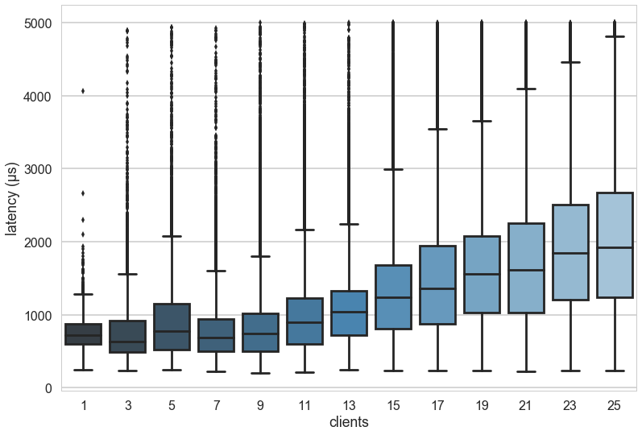
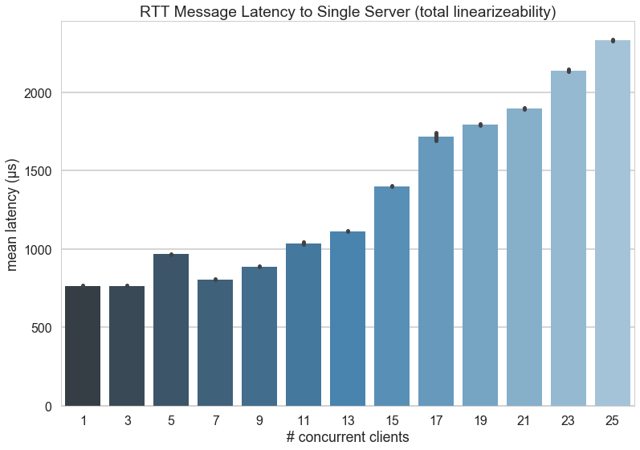
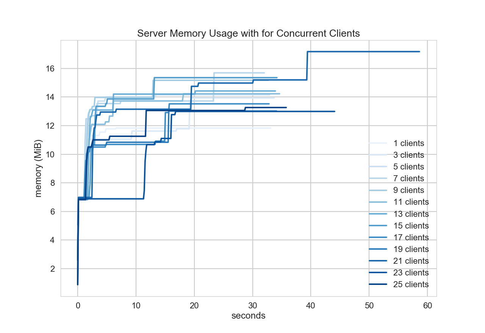

# Honu

**Throughput testing for a simple, volatile, in-memory key/value store.**

## Getting Started

First, fetch the code and install it:

    $ go get github.com/bbengfort/honu/...

You should now have `honu` on your `$PATH`:

    $ honu --help

You can run the server as follows:

    $ honu serve

Which by default will run on `:3264`, you can specify a different address with the `-a` flag. Clients can be run as follows:

    $ honu put -k foo -v bar
    $ honu get -k foo

The throughput experiment can be run for a specified duration as follows:

    $ honu run -d 30s -k foo

This will test how many writes to the server can occur within 30 seconds.

## Configuration

You can create a .env file in the local directory that you're running honu from (or export environment variables) with the following configuration:

```
HONU_SERVER_ADDR=192.168.35.1:3264
HONU_SEQUENTIAL_CONSISTENCY=false
HONU_LOCAL_KEY=foo
HONU_RUN_DURATION=30s
HONU_RUN_DISABLED=false
```

Hopefully this will help run experiments without typing in tons of arguments at the command line.

## Experiments and Results

### Linearizable Single Server on VMs

The following experiment was conducted with 25 clients running on identical virtual machines on the same rack, with a 26th virtual machine acting as the Honu server. Experiments were conducted with odd numbers of clients from 1 to 25, for a total of 13 experiments.

Each client created a _write_ workload to a single, non-conflicting object. E.g. all clients wrote to their own key (alpha to yankee using the phonetic alphabet). A PUT request was sent to the server and timed, and as soon as it was received, the next PUT request was immediately sent. Timing did not include message creation or results writing overhead, only gRPC communication. Values were a string that contained the message id and current timestamp (approximately 40-50 bytes per write).

On the server end, the store was completely linearizable, meaning that the store was locked per write, and version numbers were monotonically increasing based on when the write arrived at the server. There was no replication.

The following are the results:







