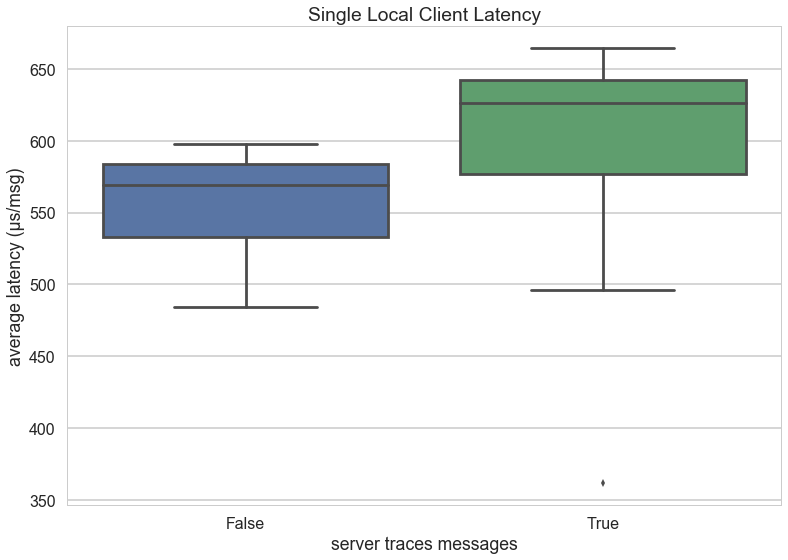
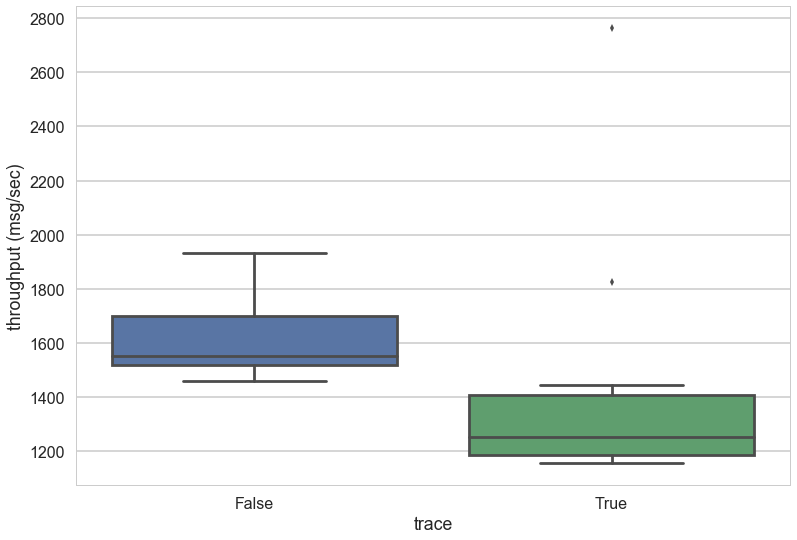
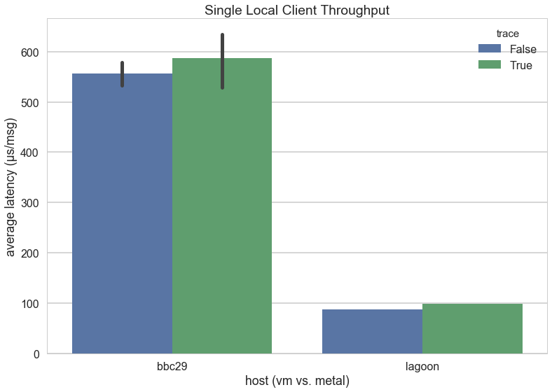
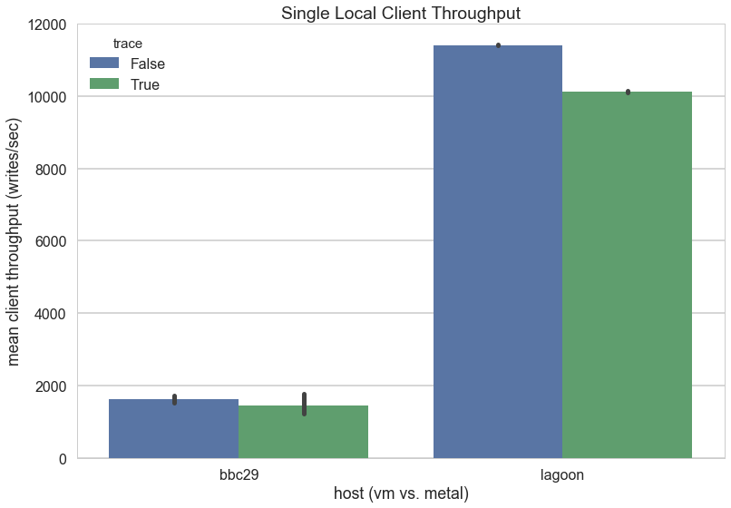

# Throughput for Local Clients on Standalone Honu

After the [VM experiments](../vms/README.md), which explored write throughput for 25 VMs to a single, standalone, linearizable Honu server on both the client and server side, we felt like the performance was not nearly good enough. Was it an issue with our VMs? Were they competing with each other?

In order to establish a baseline, we stood up a single, standalone, linearizable Honu server on a single VM, then ran the client locally on the same VM. Here we are trying to determine if the throughput is CPU bound or network bound.

The two figures above explore the distribution latency (microseconds per message) and throughput (messages per second) respectively. The figures also have two conditions, with and without message tracing, e.g. print statements to the command line on each individual message. The box plot shows the ends as the 5th and 95th percentiles, and the box is the range of the 25th to 75th percentiles, with a center line indicating the median.

While the latency is respectable, the throughput is still a disaster. Could it be that I did a terrible job programming the Honu server? Does gRPC add overhead that we are unaware of? Is it the virtual machine?

So we replicated the experiment, but this time instead of a VM, we utilized Lagoon, a quad core machine without any virtualization. The results (conditioned similarly) are as follows:

Relief! The metal performs as expected in terms of both latencies and throughput; and the trace messages has a negligible effect at that order of magnitude!
