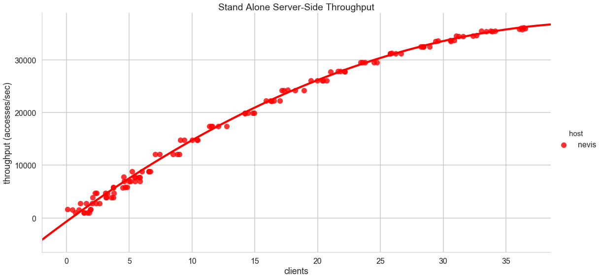

# Throughput of Standalone Honu on Metal with Multiple Processes

This is essentially a repeat of the [_Throughput for Standalone Honu on Virtual Machines_](../vms/README.md) but instead of using virtual machines, we're using multiple processes on metal to explore the results following [_Throughput for Local Clients on Standalone Honu_](local/README.md).

The setup is as follows, we have three metal machines (e.g. dedicated hardware):

- nevis: 2.10GHz i3 dual core processor
- lagoon: 3.30GHz i5 quad core processor
- hyperion: 3.40GHz i7 quad core processor

All machines have 16GiB of memory. We selected `nevis` as having the least number of dedicated processors (including hyperthreads) to be a standalone, linearizable Honu server. No other processes but the Honu server and standard OS processes were running on this machine. On Lagoon and Hyperion, we incrementally added more and more client processes in a round-robin fashion.

Our goal was to explore the difference between metal and vms for both client- and server-side throughput. In particular, we wanted to highlight the difference between the independent VMs in our Honu cluster. Note also that all hardware was connected via a local subnet, minimizing network latency.

The throughput is as follows:

The server started tailing off as more clients were added, heading towards its maximum throughput, but clearly we haven't reached it at 36 concurrent clients. The clients performed very differently depending on the hardware they were on. Weirdly, hyperion (the beefier machine) performed worse. This machine had an older operating system and a GUI OS on it, and as a result we wiped and reinstalled the OS on all machines to start from a clean slate. 
