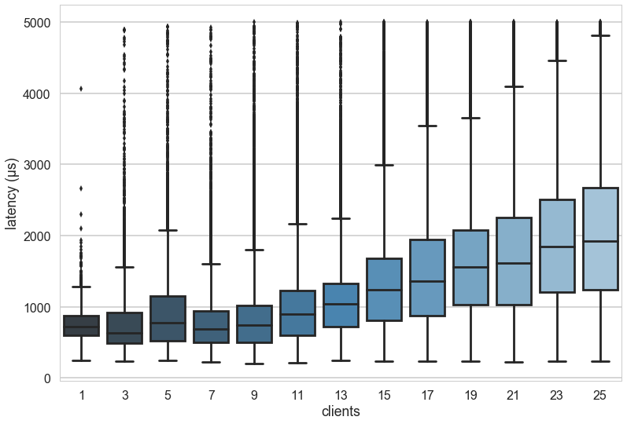
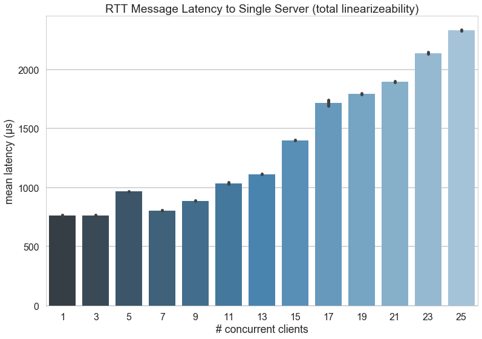
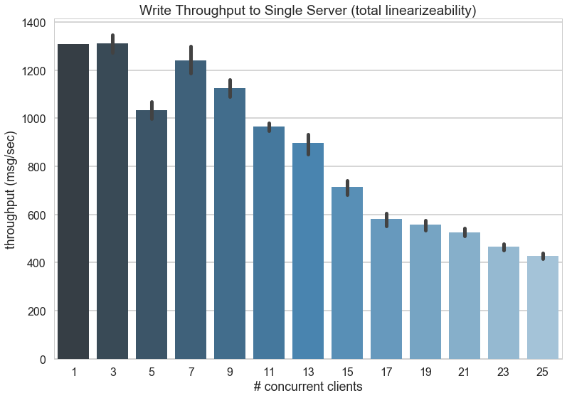
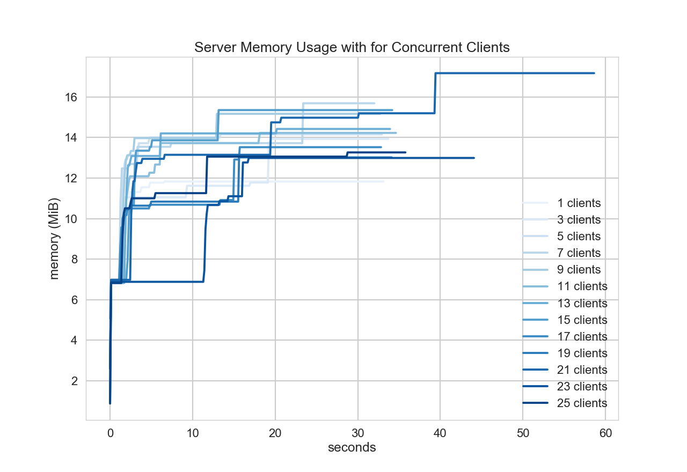
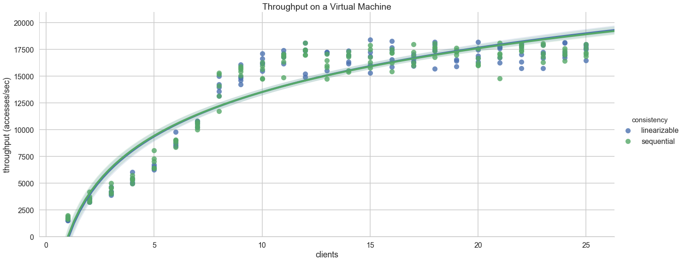

# Throughput for Standalone Honu on Virtual Machines

**Linearizable Single Server on VMs**

The following experiment was conducted with 25 clients running on identical virtual machines on the same rack, with a 26th virtual machine acting as the Honu standalone server. Experiments were conducted with odd numbers of clients from 1 to 25, for a total of 13 experiments.

Each client created a _write_ workload to a single, non-conflicting object. E.g. all clients wrote to their own key (alpha to yankee using the phonetic alphabet). A PUT request was sent to the server and timed, and as soon as it was received, the next PUT request was immediately sent. Timing did not include message creation or results writing overhead, only gRPC communication. Values were a string that contained the message id and current timestamp (approximately 40-50 bytes per write).

On the server end, the store was completely linearizable, meaning that the store was locked per write, and version numbers were monotonically increasing based on when the write arrived at the server. There was no replication.

The following are the results from the client side:

Because this is _standalone Honu_ (no replication), the client throughput only tells part of the story. The throughput of the server shows how the load degrades as more clients connect to it:

